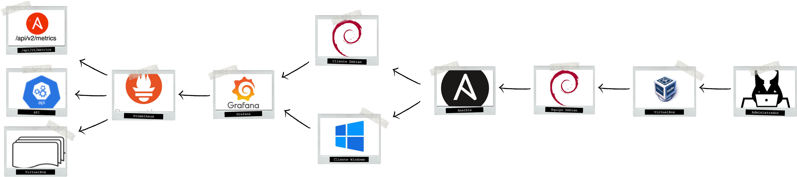

# Automatización de instalacion de servicios y aplicaciones mediante Ansible
>

Realizado en entorno *Debian*, con una lista básica de servicios y aplicaciones y contiene ficheros para poder llevar a cabo la monitorización de las automatizaciones con Ansible en hosts *Linux*, concretamente *Debian*, y *Windows*.

A continuación se pueden ver los servizos y las aplicaciones

| Servizos  | Aplicaciones |
| --- | ---------------------- |
| DNS (bind9) | Adobe Acrobat Reader |
| DHCP (isc-dhc-server) | Google Chrome |
| FTP (vsftpd) | Kaspersky |
| Samba | LibreOffice |
| Apache | Visual Studio Code |
| Docker | VLC |
| DNS + DHCP | Dia |
| DDNS (bind9 + isc-dhcp-server) | Wireshark |

> Enlaces de interés:
> * [Documentación de Ansible](https://docs.ansible.com/archive/ansible/2.7/index.html)
> * [Repositorio de paquetes Chocolatey](https://community.chocolatey.org/packages)
> * [1ª Plantilla HTML para la instalación Apache](https://plantillashtmlgratis.com/todas-las-plantillas/plantilla/plantillas-html-gratuita-para-descargar-koppee/)
> * [2ª Plantilla HTML para la instalación Apache](https://plantillashtmlgratis.com/todas-las-plantillas/plantilla/plantilla-html-gratis-medi/)

# 1.Preparación del entorno
## 1.1 En el equipo central

Para realizar cualquiera acción con Ansible primero hai tanto el propio programa como sus dependencias.

Primero se debe comprobar la versión de python, dado que tiene que ser igual o superior a la 2.6.
```
python3 -V
```

Si es inferior se debe de instalar la nueva versión:
```
apt update
apt install -y python3
```

De último se debe instalar *software-properties-common*:
```
apt install -y software-properties-common
```

Unha vez certificada la versión o/y instalado las dependencias es cuando se realiza la de la herramienta *Ansible*.
```
apt install -y ansible
```

Para comprobar la instalación se ejecutara el siguiente comando:
```
ansible --version
```

Si no se genero ningún archivo de configuración se debe crear el archivo de configuración en la ruta por defecto:
```
mkdir /etc/ansible
touch ansible.cfg
```

Unha vez creado se edita añadiendo la siguiente información que indica cual es el inventario por defecto:
```
[defaults]
inventory=/etc/ansible/hosts
```
Justo después de esto se comprueba con el siguiente comando si ya emplea el archivo de configuración creado.
```
ansible --version
```

## 1.2 En los equipos clientes *Linux*
En los equipos *Linux* lo único que se necesita es la versión *server* del servicio SSH.
```
apt install -y ssh
```

## 1.3 En los equipos clientes *Windows*
> Información y comandos extraídos del enlace [Configuración de un equipo *Windows*](https://docs.ansible.com/archive/ansible/2.7/user_guide/windows_setup.html#id2)

En los equipos *Windows* es más ociosa la tarea dadas las acciones que se deben llevar. Ya que necesita los siguientes requisitos:

* Versiones de Windows con soporte o mantenimiento extendido
* Version igual o posterior a la 3.0 de Powershell
* Version igual o posterior a la 4.0 de .NET Framework
* Tener creado y activado el WinRM Listener
  
Primero se tiene que actualizar Powershell y .NET Framework.
```
$url = "https://raw.githubusercontent.com/jborean93/ansible-windows/master/scripts/Upgrade-PowerShell.ps1"
$file = "$env:temp\Upgrade-PowerShell.ps1"
$username = "Administrator"
$password = "Password"

(New-Object -TypeName System.Net.WebClient).DownloadFile($url, $file)
Set-ExecutionPolicy -ExecutionPolicy Unrestricted -Force

# La versión puede ser 3.0, 4.0 o 5.1
&$file -Version 5.1 -Username $username -Password $password -Verbose
```
Una vez completado el paso anterior se necesita eliminar el autoinicio de sesión y volver la política a Restricted.
```
# No es necesario pero es una buena práctica de seguridad
Set-ExecutionPolicy -ExecutionPolicy Restricted -Force

$reg_winlogon_path = "HKLM:\Software\Microsoft\Windows NT\CurrentVersion\Winlogon"
Set-ItemProperty -Path $reg_winlogon_path -Name AutoAdminLogon -Value 0
Remove-ItemProperty -Path $reg_winlogon_path -Name DefaultUserName -ErrorAction SilentlyContinue
Remove-ItemProperty -Path $reg_winlogon_path -Name DefaultPassword -ErrorAction SilentlyContinue
```
Una vez realizados estes primeros pasos hay que instalar el WinRM Memory Hotfix. Es verdad que no es imperativo como tal, pero si no se instala Ansible podría fallar en la ejecución de ciertos comandos debido a que hai un *bug* o problema con el servicio WinRM que limita la memoria diponible a este. Así que, en todo caso, es preferible su instalación.
```
$url = "https://raw.githubusercontent.com/jborean93/ansible-windows/master/scripts/Install-WMF3Hotfix.ps1"
$file = "$env:temp\Install-WMF3Hotfix.ps1"

(New-Object -TypeName System.Net.WebClient).DownloadFile($url, $file)
powershell.exe -ExecutionPolicy ByPass -File $file -Verbose
```
Justo después se debe instalar el WinRM Setup para configurarlo y así Ansible se podra conectar a el. Ya que junto al WinRM Listener decide como interactúa *Ansible* con los equipos *Windows*.
```
$url = "https://raw.githubusercontent.com/ansible/ansible-documentation/devel/examples/scripts/ConfigureRemotingForAnsible.ps1"
$file = "$env:temp\ConfigureRemotingForAnsible.ps1"

(New-Object -TypeName System.Net.WebClient).DownloadFile($url, $file)

powershell.exe -ExecutionPolicy ByPass -File $file
```
El servicio WinRM Listener "escucha" por uno o varios puertos para visualizar cuales está usando se emplea el siguiente comando:
```
winrm enumerate winrm/config/Listener
```
Por último, se tiene que configurar el WinRM Listener. En este caso se configuró mediante Powershell también.
```
$selector_set = @{
    Address = "*"
    Transport = "HTTPS"
}
$value_set = @{
    CertificateThumbprint = "E6CDAA82EEAF2ECE8546E05DB7F3E01AA47D76CE"
}

New-WSManInstance -ResourceURI "winrm/config/Listener" -SelectorSet $selector_set -ValueSet $value_set
```
# 2. Playbooks
Los playbooks son de lenguaje YAML y por lo tanto usan la estructura del mismo, que usa el doble espacio por cada elemento. En ellos se indican los hosts a los que hace efecto, si necesita los permisos de superusuarios para ejecutar las tareas que se indiquen.
```
#Indica los hosts a los que afecta
- hosts: <nombre_de_los hosts>
  #Indica si usa permisos de superusuario o no
  become: yes/no
  #Indica las tareas a realizar
  tasks:
  - name: <Nombre de la tarea>
    #Indica el módulo necesario para la tarea
    <módulo>:
      #Indica los elementos necesarios para realizar la tarea
      <atributos del módulo>
```
Los módulos usados en este proyecto difieren segundo el sistema operativo destino:
| Linux | Windows |
|-------|---------|
| Apt | Win_file |
| Copy | Win_copy |
| File | Win_command/Win_shell |
| Command/Shell | Win_chocolatey |
| Openssl_privatekey ||
| Openssl_certificate ||
| Apache2_module||
# 3. Inventarios
> Enlaces relativos a los inventarios:
> Información sobre los inventarios estáticos y sus variantes [Información, inventarios y variantes](https://docs.ansible.com/archive/ansible/2.7/user_guide/intro_inventory.html)
> Opciones de inventario de Windows [Variables del inventario](https://docs.ansible.com/archive/ansible/2.7/user_guide/windows_winrm.html#inventory-options)

En este proyecto solo se usó el inventario estático en dos tipos de variantes, dado que los dinámicos están destinados para trabajar con hosts que provienen de diferentes fuentes como los proveedores Cloud o LDAP. Los inventarios se encuentra en la carpeta Inventarios. Para ambas variantes del inventario hay que crear los archivos.
## 3.1 Estático /etc/ansible/hosts
La creación del inventario se realiza de la misma manera cualquiera archivo. Es cierto que tiene que seguir coherencia con respecto a la ruta que se especifico en el archivo "/etc/ansible/ansible.cfg".
```
touch /etc/ansible/hosts
```
Y mantiene la siguiente estructura:
```
[nombre del grupo de hosts]
<ip de un hosts>
<ip de otro hosts>
```
Si se quiere se puede poner un solo host no hay ningún problema.

Si se realiza en este fichero las credenciales se deben de indicar en un fichero .yaml en un directorio dentro de */etc/ansible*.
```
mkdir /etc/ansible/group_vars
```
El archivo que contendra las credenciales para un grupo de hosts debe de tener el nombre de este, que se indicó el inventario. Y sigue la siguiente estructura difiriendo entre *Linux* y *Windows*.
```
touch <nombre_grupo_hosts>.yaml
```
```
ansible_ssh_user: <usuario>
ansible_password: <contraseña> #Sin cifrar o cifrada
#Si se indica la contraseña cifrada es IMPORTANTE DEJAR una línea en blanco
ansible_become_user: <superusuario>
ansible_become_pass: <contraseña> #Sin cifrar o cifrada
#Si se indica la contraseña cifrada es IMPORTANTE DEJAR una línea en blanco
ansible_become_method: su
ansible_ssh_common_args: '-o StrictHostKeyChecking=no'
```
```
ansible_user: Administrador
ansible_password: <contraseña> #Sin cifrar o cifrada
#Si se indica la contraseña cifrada es IMPORTANTE DEJAR una línea en blanco
ansible_port: 5986
ansible_connection: winrm
ansible_winrm_server_scheme: https
ansible_winrm_server_cert_validation: ignore
ansible_winrm_transport: basic
```
## 3.2 Estáticos .yaml
Se crea como cualquier archivo normal pero con la extensión .yaml.
```
touch inventario.yaml
```
Al ser un archivo yaml pose su estructura y por lo tanto tiene que seguir las normas específicas. Hay muchas maneras de indicar los hosts, ya que por ejemplo difiere entre los *Linux* y los *Windows*.
### 3.2.1 Para hosts *Linux*
Para este proyecto en los referentes a *Linux* solo funcionó la siguiente manera:
```
all:
  hosts:
    <nombre_host>:
      ansible_host: <ip_host>
      ansible_port: <puerto> #Puerto por el que funciona el servicio SSH
      ansible_user: <usuario>
      ansible_password: <contraseña> #Sin cifrar o cifrada
      #Si se indica la contraseña cifrada es IMPORTANTE DEJAR una línea en blanco
      ansible_become_user: <superusuario> #Nombre del superusuario, por defecto root
      ansible_become_pass: <contraseña> #Sin cifrar o cifrada
      #Línea en blanco si la contraseña se indica cifrada
      ansible_become_method: su #Forma por la que se convierte en superusuario
      ansible_ssh_common_args: '-o StrictHostKeyChecking=no' #Se indica la siguiente línea para que no pida confirmación a 1ª vez que se conecta por ssh
```
### 3.2.2 Para hosts *Windows*
Con respecto a los inventarios de *Linux* ya cambian las variables. Para los hosts windows se indico de esta manera:
```
all:
  hosts:
    <nombre_host>:
      ansible_host: <ip_host>
      ansible_user: Administrador
      ansible_password: <contraseña> #Sin cifrar o cifrada
      #Si se indica la contraseña cifrada es IMPORTANTE DEJAR una línea en blanco
      ansible_port: 5986 #Puerto https
      ansible_connection: winrm
      ansible_winrm_server_scheme: https
      ansible_winrm_server_cert_validation: ignore
      ansible_winrm_transport: basic
```
# 4. Medidas de seguridad
Una de las medidas realizadas durante el proceso fué el cifrado de las contraseñas. Y se utilizó el siguiente comando que utiliza el cifrado AES-256 (Advanced Encryption Standard) en modo CBC (Cipher Block Chaining):
```
ansible-vault encrypt_string <contrasinal> --ask-vault-pass
```
De esta manera indicando una clave de paso se cifra. Y cuando se ejecute el playbook se debe de añadir en el comando la sentencia --ask-vault-pass que pide la clave de paso utilizada cuando se cifro para descifrar mediante el algoritmo PBKDF2 (Password-Based Key Derivation Function2) para aportar mayor seguridad e impedir que intercepten las credenciales.

Un ejemplo del resultado del cifrado de una posible contraseña sería el siguiente:
>

Y la otra medida fué indicar las credenciales en otros ficheros en vez de en el comando de ejecución del playbook. En el caso de usar el inventario */etc/ansible/hosts* se tienen que indicar las credenciales con la contraseña cifrada en un fichero .yaml en el directorio */etc/ansible/group_vars*. Mientras que si se usa un inventario .yaml se indican en el mismo.

# 5. Monitorización
> Respositorio que sirvió de ayuda [Repositorio Xavki](https://gitlab.com/xavki/devopsland/-/tree/master/ansible)

Para llevara a cabo una monitorización se necesito de node exporter, prometheus y grafana. En la producción de este proceso se usaron los roles de Ansible.
```
mkdir roles
ansible-galaxy init roles/node-exporter
ansible-galaxy init roles/prometheus
ansible-galaxy init roles/grafana
```
Dentro de cada carpeta se indican los *handlers*, las tareas a realizar según se use ese rol y las variables que se empleen entre otras acciones.
Para usar estes roles se necesita en el archivo de configuración hacer mención de ellos.
```
- name: ---- #Nombre para el proceso que se empleen esos roles
  hosts: <nombre_host> #Host o hosts a los que va dirigido
  become: yes/no
  roles:
    - #Rol 1
    - #Rol 2

- name: ----
  hosts: <nombre_host>
  become: yes/no
  roles:
    - #Rol
```
Y en las carpetas tasks de cada rol se indican las tareas a realizar como comprobaciones, creaciones de usuarios y directorios, instalaciones, descargar un dashboard e un datasource y añadirlo al igual que el datasource.

Para más información sobre el proceso y o las tareas en la carpeta de Monitorizacion.
